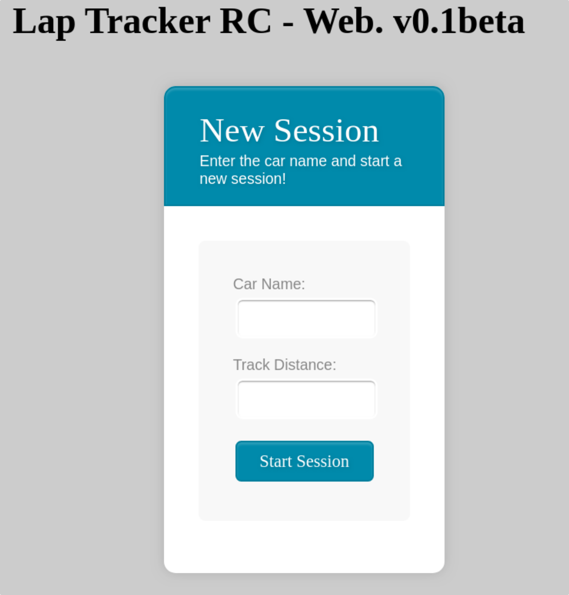
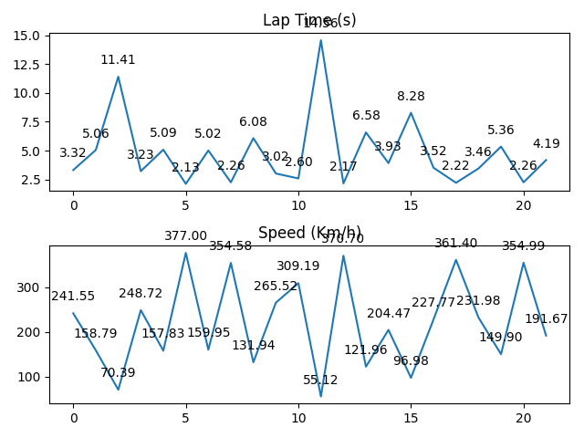

# LapTimeTrackerRC
The LapTimeTrackerRC is a django-based app that helps me to controll lap times for individual RC cars.

The software runs with a single camera that uses image differentiation to identify
when an RC car starts/finishes a lap.


##Instalation and Deploy

####Requirements
Install the Requirements.txt file.

####Configuration
You need to configure some information on the Web/LapTracker/lapTracker.py file:

| Parameters | Description |
| ------------- | ------------- |
| cameraFPS  | FPS of the camera  |
| minimumLapTime  | Minimum lap time in seconds |
| initialConfigTime  | Minimum time for initial calibration in seconds  |
| finalImageSize  | Size of the telemetry image (pixels)  |
| videoDevice  | ID of the camera used by the system  |

####Running

Make sure you have a camera connected to the machine, and update the configurations above.
Run the webserver:

```python
python manage.py runserver
```

Go to your browser and open the following link: http://127.0.0.1:8000/Web



Fill in the Car Name and the Track Distance and start the session.


####Collected Data

The system collects data about the lap time and the average velocity. All the collected data is saved inside the /static/sessions folder as a .csv file. 




##Contact

Any problems or doubts, please contact me: pablovin@gmail.com